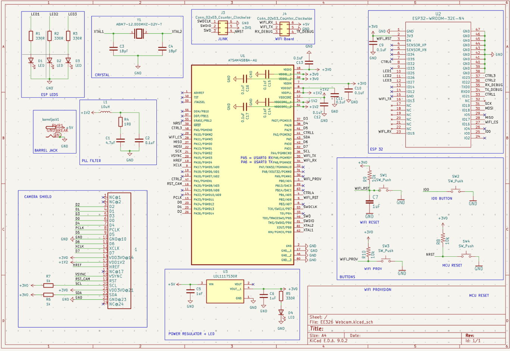
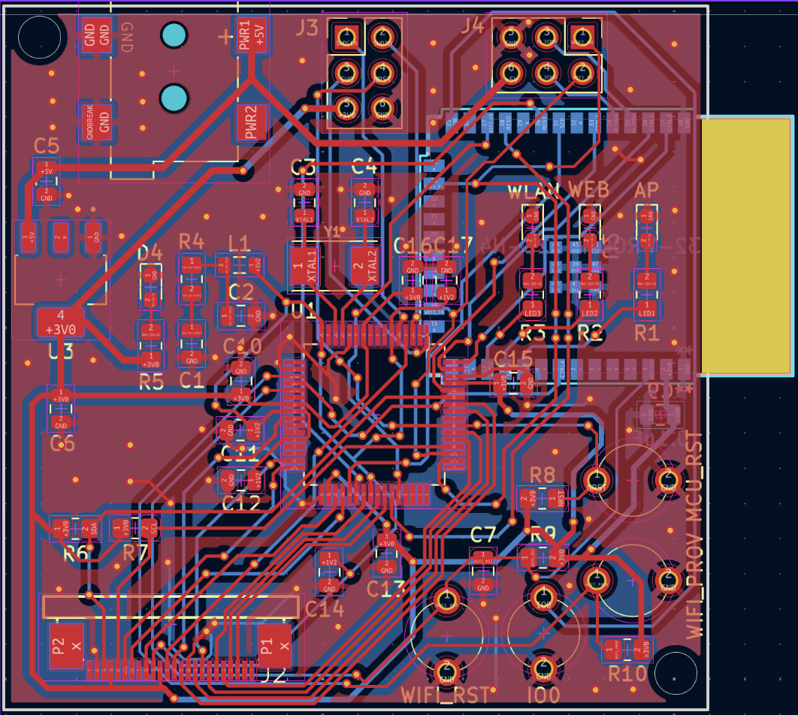
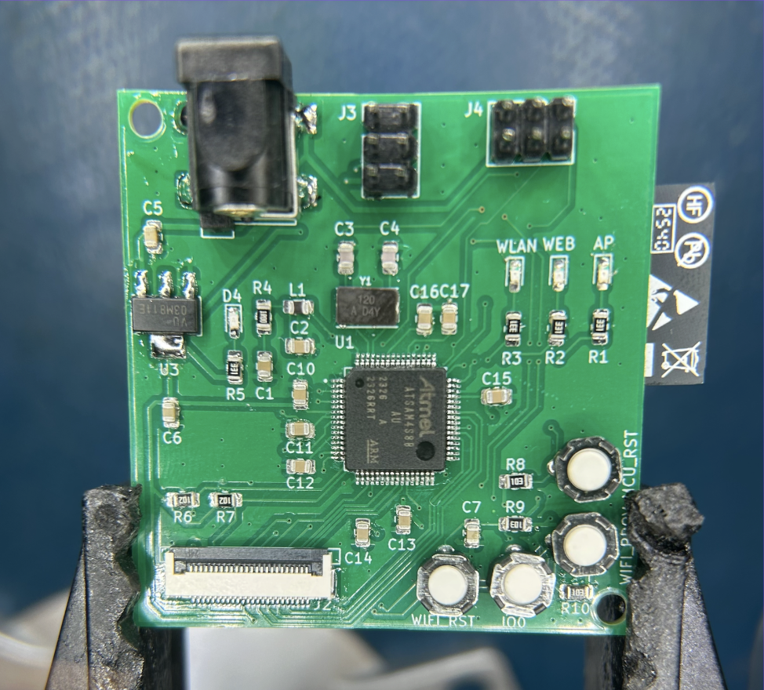

# Webcam
Objective:
Create a webcam from scratch, including PCB, firmware, and enclosure

Steps Taken:
Used KiCAD to design a compact 50 mm × 50 mm custom PCB integrating a microcontroller, ESP32 module, camera interface,  input buttons, status LEDs, power regulation circuitry, and passive components.
Developed embedded firmware in Microchip Studio to enable controlled image capture and system-level communication.
Implemented multiple communication protocols, including UART and SPI for MCU–ESP32 data exchange and debugging, and  I²C for camera initialization.
Designed a 3D printed enclosure providing access to buttons and power, visibility for indicator LEDs, and support for wall mounting.

Outcome:
A functional webcam that streams images to the web when there is a connected client.

<table align="center">
  <tr>
     <td align="center">
       
      <em>Assembled PCB</em>
    </td>
    <td align="center">
       
      <em>Routing of PCB</em>
    </td>
  </tr>
</table>

<table align="center">
  <tr>
    <td align="center">
       
      <em>Assembled PCB (hand soldered)/em>
    </td>
    <td align="center">
       
      <em>PCB inside of 3D printed box</em>
    </td>
    <td align="center">
       
      <em>Final product</em>
    </td>
  </tr>
</table>
